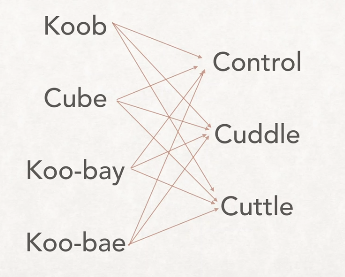

<h1>
  <span class="headline">Practical Kubernetes with kubectl and Minikube</span>
  <span class="subhead">Getting Started with kubectl</span>
</h1>

**Learning Objective:**  
By the end of this lesson, students will be able to explain what `kubectl` is, describe its purpose, and recognize its basic syntax and common commands.

## What is `kubectl`?

[kubectl](https://kubernetes.io/docs/reference/kubectl/overview/) (pronounced in several ways—see below) is the command-line tool used to interact with Kubernetes clusters. It’s your gateway to managing Kubernetes, allowing you to:

- View information about your cluster.
- Make changes like deploying applications, managing services, scaling workloads, and updating configurations.

Under the hood, `kubectl` works as a wrapper for Kubernetes API calls. This means every `kubectl` command is converted into an HTTP request sent to the Kubernetes API running on your cluster.

## How do you pronounce `kubectl`?

The pronunciation of `kubectl` is a hot topic!

But here are three commonly accepted ways to say it:

- _cube-control_ :white_check_mark:
- _cube-see-tee-ell_ :white_check_mark:
- _cube-cuttle_ :white_check_mark:

Use any of these, and you’ll be in good company.

<br>



<br>

## Understanding `kubectl` syntax

The structure of `kubectl` commands is simple and intuitive. Most commands follow this pattern:

```bash
kubectl [command] [TYPE] [NAME] [flags]
```

- **Command**: What you want to do (ex: `get`, `apply`, `describe`).
- **TYPE**: The type of resource you're working with (ex: `pod`, `service`).
- **NAME**: (Optional) The specific resource you want to target.
- **Flags**: (Optional) Additional options to customize the command.

### For example:

```bash
kubectl get pods
```

This command retrieves a list of all running pods in your cluster.

## Common kubectl commands

Here are some [frequently used commands](https://kubernetes.io/docs/reference/kubectl/cheatsheet/). You don’t need to memorize these now—we’ll practice many of them in our hands-on lesson:

### For general information

| Command                    | Description                                                        |
| -------------------------- | ------------------------------------------------------------------ |
| **`kubectl -h`**           | Displays help and a list of available commands.                    |
| **`kubectl cluster-info`** | Shows details about your cluster.                                  |
| **`kubectl version`**      | Displays the current version of `kubectl` and the cluster version. |

### For managing resources

| Command                                       | Description                                                                                              |
| --------------------------------------------- | -------------------------------------------------------------------------------------------------------- |
| **`kubectl apply -f /path/to/file.yml`**      | Applies the configuration from a YAML file to the cluster.                                               |
| **`kubectl get pods`**                        | Lists all pods running in the cluster.                                                                   |
| **`kubectl describe pod <pod-name>`**         | Displays detailed information about a specific pod, including its IP address, status, and health checks. |
| **`kubectl get services`**                    | Lists all services running in the cluster.                                                               |
| **`kubectl describe service <service-name>`** | Provides detailed information about a specific service.                                                  |

In the next section, we’ll dive into hands-on activities where you’ll use `kubectl` to interact with a Kubernetes cluster.

Ready to get started? Let’s move on to the practical lesson!
